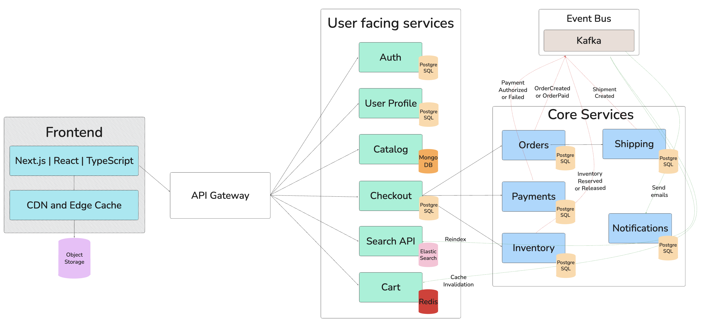

## Architecture Diagram

1️⃣ User lands on the site (Frontend)

- Next.js, React, TypeScript → This is the actual website/app the customer sees.
- Renders product pages, cart, checkout forms.
- Built in Next.js with React + TypeScript for performance and maintainability.
- CDN and Edge Cache → Images, CSS, and JS are served from a global CDN so pages load fast everywhere.

Also serves product images from Object Storage (OBJ) so they don’t overload backend services.

2️⃣ Browsing products

- The Frontend calls API Gateway (AGW) to fetch product data.

API Gateway routes:

GET /products → Catalog (CAT → MongoDB)
- MongoDB stores product details, variants, descriptions, SEO metadata.

GET /search?q=... → Search API (SRCH → Elasticsearch)
- Elasticsearch handles full-text search, filters, sorting.

3️⃣ Adding to cart

- The Frontend sends POST /cart via API Gateway to Cart (CART → Redis).
- Redis stores cart state in-memory for low latency.
- The cart may also fetch stock info from Inventory (INV → PostgreSQL) to avoid overselling.

4️⃣ Checkout

User clicks Checkout:

- API Gateway calls Checkout (CHK → PostgreSQL) service.

Checkout validates:

- Prices via Catalog

- Stock via Inventory (PostgreSQL)

If stock is available:

- Inventory reserves it (reducing available qty temporarily).

Checkout creates an order in Orders (ORD → PostgreSQL).

5️⃣ Payment

- Checkout sends payment request to Payments (PAY → PostgreSQL).

- Payments service integrates with external PSP (e.g., Stripe/Adyen).

- On success, Payments updates DB and emits PaymentAuthorized event to Event Bus (Kafka).

6️⃣ Order fulfillment

- Orders updates status to paid and emits OrderPaid event to Event Bus.

- Shipping service (SHP → PostgreSQL) listens for that event, creates shipment, sends tracking info.

7️⃣ Notifications
Notifications service (NOTIF → PostgreSQL) listens for OrderPaid and ShipmentCreated events.

Sends email or SMS confirmation to the customer.

8️⃣ Search & cache updates (asynchronous)

When Inventory or Catalog changes:

- An event (InventoryReserved, ProductUpdated) goes to the Event Bus.

- Search API reindexes Elasticsearch so results stay fresh.

- Cart invalidates caches if necessary.

# Key takeaways from the diagram in user journey terms

1. Frontend (Next.js + CDN) = fast, globally served customer experience.

2. API Gateway = the single entry point for all user-facing requests.

3. MongoDB (Catalog) = flexible product data for browsing.

4. Elasticsearch (Search) = fast and relevant search results.

5. Redis (Cart) = instant cart updates with ephemeral storage.

6. Checkout (PostgreSQL) → orchestrates the purchase flow:

    - Validates cart items against catalog & inventory
    - Reserves stock in Inventory
    - Creates the order record in Orders
    - Initiates payment with Payments

**PostgreSQL (Orders, Payments, Inventory, Shipping) = transactional backbone ensuring data consistency.**

**Event Bus = glue for async workflows (payments, shipping, notifications, reindexing).**

**Object Storage + CDN = efficient delivery of media assets.**
