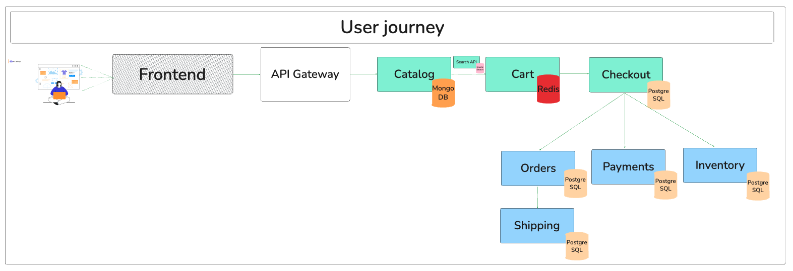

# Product catalog 
Let's consider the user journey: 

# 1. Why choosing a NoSQL database for the product catalog? [1][2]

When a user lands on the **Sportify** website, they begin by browsing the product catalog — scrolling through categories, searching for items, and viewing detailed product pages.

All this information is powered by data — and in e-commerce architectures, this data can be stored in a **non-relational (NoSQL) database**. NoSQL stands for **“Not Only SQL”**, and it represents a family of databases designed for flexibility, scalability, and performance.

So, why choose a NoSQL database over a traditional relational database for the product catalog?

Here are the three main reasons:

---

### 1.1 No strong relationships with other entities  
Unlike transactional services (e.g., checkout, orders, inventory), which require tight coupling and relational integrity, the product catalog is relatively **self-contained**.  
Products typically don’t require complex joins with other entities — each item can be stored as a **document** with all relevant fields (title, description, price, color, tags, etc.).

---

### 1.2 Frequent schema changes  
Retailers frequently update their product catalogs — especially with **seasonal products**, **promotions**, or **flash sales** (e.g., Black Friday, summer collections).  
With NoSQL databases, you can **modify the schema on the fly**, which is much harder with traditional relational databases due to rigid **ACID constraints** and the need for schema migrations.

---

### 1.3 High read performance at scale  
The product catalog is one of the **most-read components** of an e-commerce platform. Thousands of users may browse products simultaneously.  
NoSQL databases (especially document stores and key-value stores) **scale horizontally** and can handle high read loads more efficiently than RDBMSs in this context.

# 2. Why using MongoDB over Cassandra or Couchbase for product catalog?

### 2.1 Document Model Matches Catalog Needs

- MongoDB stores data as rich JSON-like documents (BSON), making it ideal for representing a product with nested attributes—variants, tags, pricing, media, etc. This delivers a flexible, intuitive schema that aligns perfectly with real-world product structures.

[Cassandra vs MongoDB Comparison](https://www.mongodb.com/resources/compare/cassandra-vs-mongodb?)
- JSON-like document format (BSON) which is easy and flexible to use and modify 
- MongoDB is optimized for both reads and writes. In case of product catalogs, lots of reads will be performed vs Cassandra which is a wide-column store optimized database, very optimized for writes. 

- Cassandra, in contrast, is a wide-column store optimized for high-volume writes and simple lookups, not structured, nested documents. It's better for time-series or log data rather than mutable, rich catalog items.

[NoSQL Comparison 2021: Couchbase Server, MongoDB, and Cassandra (DataStax)](https://www.altoros.com/blog/nosql-comparison-2021-couchbase-server-mongodb-and-cassandra-datastax/?utm_source)
- MongoDB and Couchbase are both document-oriented databases vs Cassandra which is a wide-column store. 
- Conclusion of paper: Cassandra is less suitable for a use case of an ecommerce website product catalogue because it is more optimized for high volume writes and not high volume reads.
- Between MongoDB and Couchbase, Couchbase performs better with bigger clusters and higher volumes of data --> MongoDB go to choice for most ecommerce website product catalogs and Couchbase for very big product catalog for big companies with large product catalog

[Les 7 bases de données à connaître pour pas passer pour un con](https://www.youtube.com/watch?v=080p5Y2_wpg)
1. RDBMS: PostgreSQL, MySQL, SQLServer 
- Row-based databases -> easy to find information about customers for instance as it is row based and all data is present at the same location 
- DBs used when relations are present. For instance, a checkout is related to the payment, the order, the inventory and the shipping
- ACID properties (Atomicity, Consistency, Isolation, Durability) -> ideal for transaction-related tasks (payments, orders, shipping, checkouts)
- Pros: 
    - Relations between data easy so easy to query data 
    - Ideal for transactions (ACID properties)
    - Ideal as backend databases for websites, apps
- Cons:
    - vertical scaling -> low performance for high data volumes
    - not suitable for analytics (calculation of aggregations, sums, ...)

2. Columnar BD
- Examples: Cassandra, BigQuery, RedShift
- Ideal for analytical purposes
- Highly performant for big queries
- Pros: 
    - Suited for analytical purposes 
    - Easy to split data accross multiples nodes as it is columnar based 
- Cons: 
    - Not suitable for requests read/write on back of websites as it would be too slow to gather information on a specific customer for instance

3. NoSQL document-oriented DB
- Examples: MongoDB, Couchbase, Documentdb
- Store data as JSON-like format (BSON) -> much more flexible regarding schema 
- Pros: 
    - More flexibility for developers and efficient as data regarding a customer is directly available without the need to join tables
    - Horizontal scaling 
- Cons: 
    - Less consistent than RDBMS (ACID)
    - Sometimes latent to get information from the DB 

4. NoSQL key-value DB
- Redis, Memcached
- Faster than classic NoSQL DB
- Main data will be stored on RAM so very quickly accessible (and some can be store on the cache memory)
- Very usefule to store data which should accessible very quickly (carts can be stored in Redis for instance or queus)

5. Time series DB
- Examples: Prometheus, Grafite
- Very suitable for IoT data where enormous amounts of data very regurlaly in time wille be stored

6. Graph DB
- Examples: Neo4j, Neptune, Arangodb
- Necessitates to find relations between nodes very useful to build recommendation enginees

--> TBC 

[Comment choisir la meilleure base de donnée ? (CAP Theorem)](https://www.youtube.com/watch?v=s5RQrySFXao)

---

### 2.2 Query Flexibility and Developer Experience

MongoDB supports ad-hoc queries, rich indexing, array filters, aggregations, and lookups—all in a developer-friendly model. This simplifies building features like filters, search suggestions, and category grouping.

[Wikipédia](https://en.wikipedia.org/wiki/MongoDB?utm_source)

Couchbase is a document store too, but adds complexity with N1QL querying and fewer community resources supporting agile adoption.

https://www.sprinkledata.com/blogs/couchbase-vs-mongodb-a-comprehensive-comparison-of-leading-nosql-databases?utm_source

---

### 2.3 Strong Documentation, Ecosystem, and Tooling

MongoDB delivers rich developer resources: official documentation, MongoDB University, open source tooling like Compass, and an active ecosystem — all of which accelerate onboarding and architecture iteration.

[Couchbase](https://info.couchbase.com/rs/302-GJY-034/images/NoSQL_Technical_Comparison_Report_Couchbase_Server_Cassandra_MongoDB_2017.pdf?utm_source)
[Wikipédia](https://en.wikipedia.org/wiki/MongoDB?utm_source)

Cassandra’s learning curve is steeper in comparison, especially for indexing and query design.

[Wikipédia](https://stackshare.io/stackups/cassandra-vs-couchbase-vs-mongodb?utm_source)

---

### 2.4 Balanced Scalability, Speed & Consistency

MongoDB offers managed global services (Atlas) with automatic sharding and high availability for operational ease.

[IT Pro](https://www.itpro.com/cloud/367937/best-cloud-databases-in-2022?utm_source)

While Couchbase handles scaling well, it requires more manual tuning and configuration (node balancing, cluster rebalancing). For most product catalog needs, MongoDB is easier operationally.

[Couchbase](https://www.couchbase.com/blog/3-reasons-enterprises-turn-from-mongodb-to-couchbase/?utm_source=chatgpt.com)

# Bibliography
[1] [NoSQL vs. relational: Which database should you use for your app? - Microsoft](https://devblogs.microsoft.com/cosmosdb/nosql-vs-relational-which-database-should-you-use-for-your-app/#:~:text=Traditionally%2C%20the%20answer%20has%20been,handle%20anymore%20requests%20or%20data.)

[2] [When to Use a NoSQL Database - MongoDB](https://www.mongodb.com/resources/basics/databases/nosql-explained/when-to-use-nosql)
